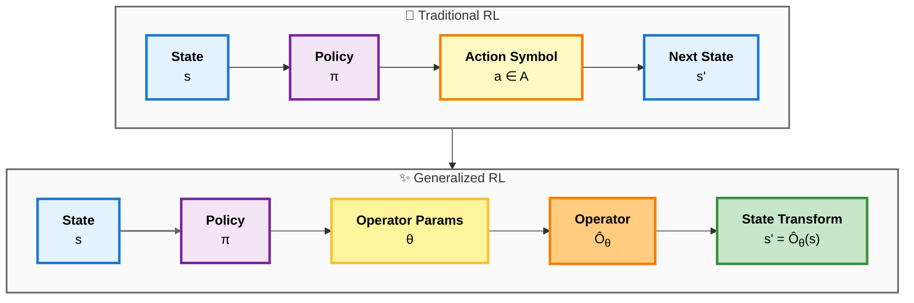

# GRL: Generalized Reinforcement Learning

**Actions as Operators on State Space**

[](https://www.python.org/downloads/)
[](https://pytorch.org/)
[](https://opensource.org/licenses/MIT)

**📚 [Read the documentation →](https://pleiadian53.github.io/GRL/)**

---

## What is GRL?

**Generalized Reinforcement Learning (GRL)** redefines the concept of "action" in reinforcement learning. Instead of treating actions as discrete indices or fixed-dimensional vectors, GRL models actions as **parametric operators** that transform the state space.


```mermaid
flowchart TB
    subgraph TRL["🔵 Traditional RL"]
        direction LR
        S1["<b>State</b><br/>s"] --> P1["<b>Policy</b><br/>π"]
        P1 --> A1["<b>Action Symbol</b><br/>a ∈ A"]
        A1 --> NS1["<b>Next State</b><br/>s'"]
    end

    TRL --> GRL

    subgraph GRL["✨ Generalized RL"]
        direction LR
        S2["<b>State</b><br/>s"] --> P2["<b>Policy</b><br/>π"]
        P2 --> AP["<b>Operator Params</b><br/>θ"]
        AP --> OP["<b>Operator</b><br/>Ô<sub>θ</sub>"]
        OP --> ST["<b>State Transform</b><br/>s' = Ô<sub>θ</sub>(s)"]
    end

    style S1 fill:#e3f2fd,stroke:#1976d2,stroke-width:3px,color:#000
    style NS1 fill:#e3f2fd,stroke:#1976d2,stroke-width:3px,color:#000
    style A1 fill:#fff9c4,stroke:#f57c00,stroke-width:3px,color:#000
    style P1 fill:#f3e5f5,stroke:#7b1fa2,stroke-width:3px,color:#000

    style S2 fill:#e3f2fd,stroke:#1976d2,stroke-width:3px,color:#000
    style ST fill:#c8e6c9,stroke:#388e3c,stroke-width:3px,color:#000
    style AP fill:#fff59d,stroke:#fbc02d,stroke-width:3px,color:#000
    style OP fill:#ffcc80,stroke:#f57c00,stroke-width:3px,color:#000
    style P2 fill:#f3e5f5,stroke:#7b1fa2,stroke-width:3px,color:#000

    style TRL fill:#fafafa,stroke:#666,stroke-width:2px
    style GRL fill:#fafafa,stroke:#666,stroke-width:2px

    linkStyle 4 stroke:#666,stroke-width:2px
```

This formulation, inspired by the **least-action principle** in physics, leads to policies that are not only optimal but also physically grounded, preferring smooth, efficient transformations over abrupt changes.

The consequence is that classical RL becomes a special case. Discretize the operators and GRL recovers Q-learning; use neural networks and it recovers DQN; apply Boltzmann policies and it recovers REINFORCE and Actor-Critic. See [Recovering Classical RL](https://pleiadian53.github.io/GRL/GRL0/recovering_classical_rl/).

---

## Documentation

Everything lives at **[pleiadian53.github.io/GRL](https://pleiadian53.github.io/GRL/)**.

| Track | What it covers |
|---|---|
| **[Reinforcement Fields](https://pleiadian53.github.io/GRL/GRL0/tutorials/00-overview/)** | The tutorial paper. Particle-based belief representation, energy landscapes, RKHS foundations, functional learning over augmented state-action space |
| **[Quantum-Inspired Extensions](https://pleiadian53.github.io/GRL/GRL0/quantum_inspired/)** | Complex-valued RKHS, probability amplitudes, concept subspaces, path integrals |
| **[Action Operators](https://pleiadian53.github.io/GRL/action_operator/01-the-grl0-gap/)** | Actions as operators, Parts 1-4: the formalism, operator families and Lie group structure, learned kernels, and the first experiment |
| **[Policy Gradient](https://pleiadian53.github.io/GRL/policy_gradient/01_PG/)** | Background series: PG, TRPO, PPO and variants, GRPO, and the bridge to operators |
| **[Research Roadmap](https://pleiadian53.github.io/GRL/ROADMAP/)** | What is written, what is next, what is planned. **The single source of truth for status** |

Browsing the source instead? [`docs/README.md`](docs/README.md) maps the directory.

---

## Quick Start

```bash
git clone https://github.com/pleiadian53/GRL.git
cd GRL

mamba env create -f environment.yml
mamba activate grl
pip install -e .

python scripts/verify_installation.py   # auto-detects CPU/GPU/MPS
```

See **[INSTALL.md](INSTALL.md)** for detailed setup, troubleshooting, and GPU notes.

Then start with [Chapter 0: Overview](https://pleiadian53.github.io/GRL/GRL0/tutorials/00-overview/).

---

## Research

**Original paper:** [arXiv:2208.04822](https://arxiv.org/abs/2208.04822) (Chiu & Huber, 2022). *Generalized Reinforcement Learning: Experience Particles, Action Operator, Reinforcement Field, Memory Association, and Decision Concepts.* 37 pages, 15 figures.

This repository develops the framework in two directions. **Reinforcement Fields** is the tutorial-paper track, reworking the original with enhanced exposition and modern formalization. **Actions as Operators** is the extension track, where operator manifolds replace fixed action spaces and operator algebra supplies compositional structure.

The operator track's first experiment is running in the sibling project **[ssl-lab](https://github.com/pleiadian53/ssl-lab)**, on cell-perturbation data, and is written up as [Part 4: The Minimum Viable Experiment](https://pleiadian53.github.io/GRL/action_operator/04-the-minimum-viable-experiment/). Its headline result is negative and reported as one.

---

## Citation

```bibtex
@article{chiu2022generalized,
  title={Generalized Reinforcement Learning: Experience Particles, Action Operator,
         Reinforcement Field, Memory Association, and Decision Concepts},
  author={Chiu, Po-Hsiang and Huber, Manfred},
  journal={arXiv preprint arXiv:2208.04822},
  year={2022},
  url={https://arxiv.org/abs/2208.04822}
}
```

The tutorial series and the operator extensions are in preparation. Entries for those are on the [documentation site](https://pleiadian53.github.io/GRL/#citation).

---

## License

MIT. See [LICENSE](LICENSE).
