# GRL: Generalized Reinforcement Learning

**Actions as Operators on State Space**

[](https://www.python.org/downloads/)
[](https://pytorch.org/)
[](https://opensource.org/licenses/MIT)

---

## 🎯 What is GRL?

**Generalized Reinforcement Learning (GRL)** redefines the concept of "action" in reinforcement learning. Instead of treating actions as discrete indices or fixed-dimensional vectors, GRL models actions as **parametric operators** that transform the state space.

```mermaid
flowchart TB
    subgraph TRL["🔵 Traditional RL"]
        direction LR
        S1["<b>State</b><br/>s"] --> P1["<b>Policy</b><br/>π"]
        P1 --> A1["<b>Action Symbol</b><br/>a ∈ A"]
        A1 --> NS1["<b>Next State</b><br/>s'"]
    end
    
    TRL --> GRL
    
    subgraph GRL["✨ Generalized RL"]
        direction LR
        S2["<b>State</b><br/>s"] --> P2["<b>Policy</b><br/>π"]
        P2 --> AP["<b>Operator Params</b><br/>θ"]
        AP --> OP["<b>Operator</b><br/>Ô<sub>θ</sub>"]
        OP --> ST["<b>State Transform</b><br/>s' = Ô<sub>θ</sub>(s)"]
    end
    
    style S1 fill:#e3f2fd,stroke:#1976d2,stroke-width:3px,color:#000
    style NS1 fill:#e3f2fd,stroke:#1976d2,stroke-width:3px,color:#000
    style A1 fill:#fff9c4,stroke:#f57c00,stroke-width:3px,color:#000
    style P1 fill:#f3e5f5,stroke:#7b1fa2,stroke-width:3px,color:#000
    
    style S2 fill:#e3f2fd,stroke:#1976d2,stroke-width:3px,color:#000
    style ST fill:#c8e6c9,stroke:#388e3c,stroke-width:3px,color:#000
    style AP fill:#fff59d,stroke:#fbc02d,stroke-width:3px,color:#000
    style OP fill:#ffcc80,stroke:#f57c00,stroke-width:3px,color:#000
    style P2 fill:#f3e5f5,stroke:#7b1fa2,stroke-width:3px,color:#000
    
    style TRL fill:#fafafa,stroke:#666,stroke-width:2px
    style GRL fill:#fafafa,stroke:#666,stroke-width:2px
    
    linkStyle 4 stroke:#666,stroke-width:2px
```



This formulation, inspired by the **least-action principle** in physics, leads to policies that are not only optimal but also physically grounded—preferring smooth, efficient transformations over abrupt changes.

---

## 📖 Tutorial Papers

### Part I: Reinforcement Fields — Particle-Based Learning

**Status:** 🔄 In progress (6/10 chapters complete)

Particle-based belief representation, energy landscapes, and functional learning over augmented state-action space.

**[Start Learning →](docs/GRL0/tutorials/00-overview.md)**

| Section | Chapters | Topics |
|---------|----------|--------|
| **Foundations** | [0](docs/GRL0/tutorials/00-overview.md), [1](docs/GRL0/tutorials/01-core-concepts.md), [2](docs/GRL0/tutorials/02-rkhs-foundations.md), [3](docs/GRL0/tutorials/03-energy-and-fitness.md) | Augmented space, particles, RKHS, energy |
| **Field & Memory** | [4](docs/GRL0/tutorials/04-reinforcement-field.md), [5](docs/GRL0/tutorials/05-particle-memory.md) | Functional fields, belief states |
| **Algorithms** | 6-7 | MemoryUpdate, RF-SARSA |
| **Interpretation** | 8-10 | Soft transitions, POMDP, synthesis |

---

### Part II: Reinforcement Fields — Emergent Structure & Spectral Abstraction

**Status:** 📋 Planned (after Part I)

Spectral discovery of hierarchical concepts through functional clustering in RKHS.

| Section | Chapters | Topics |
|---------|----------|--------|
| **Functional Clustering** | 11 | Clustering in function space |
| **Spectral Concepts** | 12 | Concepts as eigenmodes |
| **Hierarchical Control** | 13 | Multi-level abstraction |

**Based on:** Section V of the [original paper](https://arxiv.org/abs/2208.04822)

**Reading time:** ~10 hours total (both parts)

---

## 🔑 Key Innovations

| Aspect | Classical RL | GRL |
|--------|--------------|-----|
| **Action** | Discrete index or vector | Parametric operator $\hat{O}(\theta)$ |
| **Action Space** | Finite or bounded | Continuous manifold |
| **Value Function** | $Q(s, a)$ | Reinforcement field $Q^+(s, \theta)$ over augmented space |
| **Experience** | Replay buffer | Particle memory in RKHS |
| **Policy** | Learned function | Inferred from energy landscape |
| **Uncertainty** | External (dropout, ensembles) | Emergent from particle sparsity |

### Why GRL?

- **Continuous action generation**: No discretization, full precision
- **Smooth generalization**: Nearby parameters → similar behavior  
- **Compositional actions**: Operators can be composed
- **Physical interpretability**: Parameters have meaning (forces, torques)
- **Uncertainty quantification**: Sparse particles = high uncertainty

---

## 🚀 Quick Start

### Installation

```bash
# Clone the repository
git clone https://github.com/pleiadian53/GRL.git
cd GRL

# Create environment with mamba/conda
mamba env create -f environment.yml
mamba activate grl

# Install in development mode
pip install -e .

# Verify installation (auto-detects CPU/GPU/MPS)
python scripts/verify_installation.py
```

See [INSTALL.md](INSTALL.md) for detailed instructions.

### First Steps

1. **Read the tutorial**: Start with [Chapter 0: Overview](docs/GRL0/tutorials/00-overview.md)
2. **Explore concepts**: Work through [Chapter 1: Core Concepts](docs/GRL0/tutorials/01-core-concepts.md)
3. **Understand algorithms**: See the algorithm chapters (coming soon)
4. **Implement**: Follow the [implementation guide](docs/GRL0/implementation/)

---

## 📁 Project Structure

```
GRL/
├── src/grl/                    # Core library
│   ├── core/                   # Particle memory, kernels
│   ├── algorithms/             # MemoryUpdate, RF-SARSA
│   ├── envs/                   # Environments
│   └── visualization/          # Plotting tools
├── docs/                       # 📚 Public documentation
│   └── GRL0/                   # Tutorial paper (Reinforcement Fields)
│       ├── tutorials/          # Tutorial chapters (6/10 complete)
│       ├── paper/              # Paper-ready sections
│       └── implementation/     # Implementation specs
├── notebooks/                  # Jupyter notebooks
│   └── vector_field.ipynb     # Vector field demonstrations
├── examples/                   # Runnable examples
├── scripts/                    # Utility scripts
├── tests/                      # Unit tests
└── configs/                    # Configuration files
```

---

## 📄 Documentation

### Tutorial Papers: Reinforcement Fields (Two Parts)

**Part I: Particle-Based Learning** (6/10 chapters complete)

- **[Start Here](docs/GRL0/tutorials/00-overview.md)** — Overview
- **[Tutorials](docs/GRL0/tutorials/)** — Chapter-by-chapter learning
- **[Implementation](docs/GRL0/implementation/)** — Technical specifications

**Part II: Emergent Structure & Spectral Abstraction** (Planned)

### Additional Resources

- **[Installation Guide](INSTALL.md)** — Detailed setup instructions
- **[Vector Field Demo](notebooks/vector_field.ipynb)** — Interactive visualizations

---

## 🔬 Research Papers

### Original Paper (arXiv 2022)

**[Generalized Reinforcement Learning: Experience Particles, Action Operator, Reinforcement Field, Memory Association, and Decision Concepts](https://arxiv.org/abs/2208.04822)**

*Po-Hsiang Chiu, Manfred Huber*  
arXiv:2208.04822 (2022) — 37 pages, 15 figures

The foundational work introducing particle-based belief states, reinforcement fields, and concept-driven learning.

---

### Tutorial Papers (This Repository)

**Reinforcement Fields Framework** — Enhanced exposition with modern formalization

**Part I: Particle-Based Learning**
- Functional fields over augmented state-action space
- Particle memory as belief state in RKHS
- MemoryUpdate and RF-SARSA algorithms
- Emergent soft state transitions, POMDP interpretation

**Status:** 🔄 Tutorial in progress (6/10 chapters complete)

**Part II: Emergent Structure & Spectral Abstraction**
- Functional clustering (clustering functions, not points)
- Spectral methods on kernel matrices
- Concepts as coherent subspaces of the reinforcement field
- Hierarchical policy organization

**Status:** 📋 Planned (after Part I)

---

### Planned Extensions

| Paper | Title | Status |
|-------|-------|--------|
| **Paper A** | **Generalized Reinforcement Learning — Actions as Operators** | 📋 Drafting |
| | *Operator algebra, generalized Bellman equation, energy regularization* | |
| **Paper B** | **Operator Policies — Learning State-Space Operators with Neural Operator Networks** *(tentative)* | 📋 Planned |
| | *Neural operators, scalable training, operator-actor-critic* | |
| **Paper C** | **Applications of GRL to Physics, Robotics, and Differentiable Control** *(tentative)* | 📋 Planned |
| | *Physics-based control, compositional behaviors, transfer learning* | |

**Timeline**: Papers A-C will be developed after the Reinforcement Field baseline is complete.

---

## 📊 How GRL Works: Particle-Based Learning

```mermaid
flowchart LR
    A["🌍 <b>State</b><br/>s"] --> B["💾 <b>Query</b><br/>Memory Ω"]
    B --> C["📊 <b>Compute</b><br/>Field Q⁺"]
    C --> D["🎯 <b>Infer</b><br/>Action θ"]
    D --> E["⚡ <b>Execute</b><br/>Operator"]
    E --> F["👁️ <b>Observe</b><br/>s', r"]
    F --> G["✨ <b>Create</b><br/>Particle"]
    G --> H["🔄 <b>Update</b><br/>Memory"]
    H -->|Loop| B
    
    style A fill:#e3f2fd,stroke:#1976d2,stroke-width:3px,color:#000
    style B fill:#fff9c4,stroke:#f57c00,stroke-width:3px,color:#000
    style C fill:#f3e5f5,stroke:#7b1fa2,stroke-width:3px,color:#000
    style D fill:#fff59d,stroke:#fbc02d,stroke-width:3px,color:#000
    style E fill:#ffcc80,stroke:#f57c00,stroke-width:3px,color:#000
    style F fill:#c8e6c9,stroke:#388e3c,stroke-width:3px,color:#000
    style G fill:#f8bbd0,stroke:#c2185b,stroke-width:3px,color:#000
    style H fill:#b2dfdb,stroke:#00796b,stroke-width:3px,color:#000
```



### Code Example

```python
from grl.core import ParticleMemory
from grl.core import RBFKernel
from grl.algorithms import MemoryUpdate, RFSarsa

# Create particle memory (the agent's belief state)
memory = ParticleMemory()

# Define similarity kernel
kernel = RBFKernel(lengthscale=1.0)

# Learning loop
for episode in range(num_episodes):
    state = env.reset()
    
    for step in range(max_steps):
        # Infer action from particle memory
        action = infer_action(memory, state, kernel)
        
        # Execute and observe
        next_state, reward, done = env.step(action)
        
        # Update particle memory (belief transition)
        memory = memory_update(memory, state, action, reward, kernel)
        
        state = next_state
```

---

## 📝 Citation

### Original arXiv Paper

The foundational work is available on arXiv:

**Chiu, P.-H., & Huber, M. (2022).** *Generalized Reinforcement Learning: Experience Particles, Action Operator, Reinforcement Field, Memory Association, and Decision Concepts.* arXiv:2208.04822.

```bibtex
@article{chiu2022generalized,
  title={Generalized Reinforcement Learning: Experience Particles, Action Operator, 
         Reinforcement Field, Memory Association, and Decision Concepts},
  author={Chiu, Po-Hsiang and Huber, Manfred},
  journal={arXiv preprint arXiv:2208.04822},
  year={2022},
  url={https://arxiv.org/abs/2208.04822}
}
```

**[Read on arXiv →](https://arxiv.org/abs/2208.04822)**

---

### Tutorial Papers (This Repository)

The tutorial series provides enhanced exposition and modern formalization:

**Part I: Particle-Based Learning** (In progress)
```bibtex
@article{chiu2026part1,
  title={Reinforcement Fields: Particle-Based Learning},
  author={Chiu, Po-Hsiang and Huber, Manfred},
  journal={In preparation},
  year={2026}
}
```

**Part II: Emergent Structure & Spectral Abstraction** (Planned)
```bibtex
@article{chiu2026part2,
  title={Reinforcement Fields: Emergent Structure and Spectral Abstraction},
  author={Chiu, Po-Hsiang and Huber, Manfred},
  journal={In preparation},
  year={2026}
}
```

---

### Operator Extensions (Future Work)

```bibtex
@article{chiu2026operators,
  title={Generalized Reinforcement Learning — Actions as Operators},
  author={Chiu, Po-Hsiang},
  journal={In preparation},
  year={2026+}
}
```

---

## 📜 License

This project is licensed under the MIT License - see the [LICENSE](LICENSE) file for details.

---

## 🌟 The GRL Framework

**GRL** (Generalized Reinforcement Learning) is a family of methods that rethink how actions are represented and learned.

**Original paper:** [arXiv:2208.04822](https://arxiv.org/abs/2208.04822) (Chiu & Huber, 2022)

### Reinforcement Fields (This Repository)

**Two-Part Tutorial Series:**

**Part I: Particle-Based Learning**
- Actions as continuous parameters in augmented state-action space
- Particle memory as belief state, kernel-induced value functions
- Learning through energy landscape navigation

**Part II: Emergent Structure & Spectral Abstraction**
- Concepts emerge from functional clustering in RKHS
- Spectral methods discover hierarchical structure
- Multi-level policy organization

**Key Innovation**: Learning emerges from particle dynamics in function space, not explicit policy optimization.

---

### Actions as Operators (Paper A — In Development)

**Core Idea**: Actions as parametric operators that transform state space, with operator algebra providing compositional structure.

**Key Innovation**: Operator manifolds replace fixed action spaces, enabling compositional behaviors and physical interpretability.

---

## 🙏 Acknowledgments

### Mathematical Foundations

**Core Framework:**
- Formulated in **Reproducing Kernel Hilbert Spaces (RKHS)** — the functional framework for particle-based belief states
- **Kernel methods** define the geometry and similarity structure of augmented state-action space
- Inspired by the **least-action principle** in classical mechanics

**Quantum-Inspired Probability:**
- **Probability amplitudes** instead of direct probabilities — RKHS inner products as amplitude overlaps
- **Complex-valued RKHS** enabling interference effects and phase semantics for temporal/contextual dynamics
- **Wave function analogy** — The reinforcement field as a superposition of particle basis states
- This formulation is **novel to mainstream ML** and opens new directions for probabilistic reasoning

See: [Quantum-Inspired Extensions](docs/GRL0/quantum-inspired/) for technical details (forthcoming).

### Conceptual Connections
- **Energy-based models** (EBMs) — Control as energy landscape navigation
- **POMDPs** and **belief-based control** — Particle ensembles as implicit belief states
- **Score-based methods** — Energy gradients guide policy inference

### Implementation Tools
- **Gaussian process regression** can model scalar energy fields (but is not essential to the framework)
- **Neural operators** for learning parametric action transformations
- **Diffusion models** share the gradient-field perspective

---

**[📚 Start the Tutorial →](docs/GRL0/tutorials/00-overview.md)**
