# GRL: Generalized Reinforcement Learning

**Actions as Operators on State Space**

[](https://www.python.org/downloads/)
[](https://pytorch.org/)
[](https://opensource.org/licenses/MIT)

---

## 🎯 What is GRL?

**Generalized Reinforcement Learning (GRL)** redefines the concept of "action" in reinforcement learning. Instead of treating actions as discrete indices or fixed-dimensional vectors, GRL models actions as **parametric operators** that transform the state space.

```mermaid
graph LR
    subgraph Traditional RL
        S1[State s] --> P1[Policy π]
        P1 --> A1[Action a ∈ A]
        A1 --> S2[Next State s']
    end
    
    subgraph GRL
        S3[State s] --> P2[Policy π]
        P2 --> O1[Operator Parameters θ]
        O1 --> O2[Operator Ô<sub>θ</sub>]
        O2 --> S4[State Transformation]
    end
    
    style S1 fill:#e1f5ff,stroke:#01579b
    style S2 fill:#e1f5ff,stroke:#01579b
    style A1 fill:#fff3e0,stroke:#e65100
    style P1 fill:#f3e5f5,stroke:#4a148c
    
    style S3 fill:#e1f5ff,stroke:#01579b
    style S4 fill:#e8f5e9,stroke:#1b5e20
    style O1 fill:#fff9c4,stroke:#f57f17
    style O2 fill:#ffe0b2,stroke:#e65100
    style P2 fill:#f3e5f5,stroke:#4a148c
```



This formulation, inspired by the **least-action principle** in physics, leads to policies that are not only optimal but also physically grounded—preferring smooth, efficient transformations over abrupt changes.

---

## 📖 Tutorial Paper: Understanding GRL

We present GRL as a comprehensive **tutorial paper**, allowing you to learn at your own pace:

### [Start Learning → docs/GRL0/](docs/GRL0/)

| Part | Chapters | What You'll Learn |
|------|----------|-------------------|
| **I: Foundations** | [0: Overview](docs/GRL0/tutorials/00-overview.md), [1: Core Concepts](docs/GRL0/tutorials/01-core-concepts.md), 2-3 | Augmented space, particles, kernels, RKHS |
| **II: Reinforcement Field** | 4-5 | Value functions over augmented space |
| **III: Algorithms** | 6-7 | MemoryUpdate, RF-SARSA |
| **IV: Theory** | 8-10 | Soft transitions, POMDP interpretation |
| **V: Implementation** | 14-16 | From theory to code |

**Reading time**: ~2 hours for overview, ~8 hours for complete understanding

---

## 🔑 Key Innovations

| Aspect | Classical RL | GRL |
|--------|--------------|-----|
| **Action** | Discrete index or vector | Parametric operator $\hat{O}(\theta)$ |
| **Action Space** | Finite or bounded | Continuous manifold |
| **Value Function** | $Q(s, a)$ | Reinforcement field $Q^+(s, \theta)$ over augmented space |
| **Experience** | Replay buffer | Particle memory in RKHS |
| **Policy** | Learned function | Inferred from energy landscape |
| **Uncertainty** | External (dropout, ensembles) | Emergent from particle sparsity |

### Why GRL?

- **Continuous action generation**: No discretization, full precision
- **Smooth generalization**: Nearby parameters → similar behavior  
- **Compositional actions**: Operators can be composed
- **Physical interpretability**: Parameters have meaning (forces, torques)
- **Uncertainty quantification**: Sparse particles = high uncertainty

---

## 🚀 Quick Start

### Installation

```bash
# Clone the repository
git clone https://github.com/pleiadian53/GRL.git
cd GRL

# Create environment with mamba/conda
mamba env create -f environment.yml
mamba activate grl

# Install in development mode
pip install -e .

# Verify installation (auto-detects CPU/GPU/MPS)
python scripts/verify_installation.py
```

See [INSTALL.md](INSTALL.md) for detailed instructions.

### First Steps

1. **Read the tutorial**: Start with [Chapter 0: Overview](docs/GRL0/tutorials/00-overview.md)
2. **Explore concepts**: Work through [Chapter 1: Core Concepts](docs/GRL0/tutorials/01-core-concepts.md)
3. **Understand algorithms**: See the algorithm chapters (coming soon)
4. **Implement**: Follow the [implementation guide](docs/GRL0/implementation/)

---

## 📁 Project Structure

```
GRL/
├── src/grl/                    # Core library
│   ├── core/                   # Particle memory, kernels
│   ├── algorithms/             # MemoryUpdate, RF-SARSA
│   ├── envs/                   # Environments
│   └── visualization/          # Plotting tools
├── docs/                       # 📚 Public documentation
│   └── GRL0/                   # Tutorial paper for GRL-v0
│       ├── tutorials/          # Tutorial chapters
│       ├── paper/              # Paper-ready sections
│       └── implementation/     # Implementation specs
├── notebooks/                  # Jupyter notebooks
│   └── vector_field.ipynb     # Vector field demonstrations
├── examples/                   # Runnable examples
├── demo/                       # Demo folder (DQN examples)
├── scripts/                    # Utility scripts
├── tests/                      # Unit tests
└── configs/                    # Configuration files
```

---

## 📄 Documentation

### GRL-v0 Tutorial Paper

The comprehensive guide to understanding GRL:

- **[Overview](docs/GRL0/README.md)** — Start here
- **[Tutorials](docs/GRL0/tutorials/)** — Chapter-by-chapter learning
- **[Implementation](docs/GRL0/implementation/)** — Technical specifications

### Additional Resources

- **[Installation Guide](INSTALL.md)** — Detailed setup instructions
- **[Theory](docs/theory/)** — Mathematical foundations
- **[Vector Field Demo](notebooks/vector_field.ipynb)** — Interactive visualizations

---

## 🔬 Research Roadmap

### Current: GRL-v0 (Baseline)

Understanding and reimplementing the original GRL framework with:
- Particle-based belief representation
- Kernel-induced reinforcement field  
- Two-layer RF-SARSA algorithm
- Emergent soft state transitions
- POMDP interpretation

### Planned Extensions

| Paper | Focus | Status |
|-------|-------|--------|
| **Paper A** | Operator algebra and theory | 📋 Planned |
| **Paper B** | Algorithms and neural operators | 📋 Planned |
| **Paper C** | Applications and experiments | 📋 Planned |

---

## 📊 How GRL Works: Particle-Based Learning

```mermaid
graph TD
    A[Environment State s] --> B[Query Particle Memory Ω]
    B --> C[Compute Reinforcement Field<br/>Q⁺<sub>z</sub> = Σ w<sub>i</sub> k<sub>z, z<sub>i</sub></sub>]
    C --> D[Infer Action Parameters θ<br/>via Energy Minimization]
    D --> E[Execute Operator Ô<sub>θ</sub>]
    E --> F[Observe s', r]
    F --> G[Create/Update Particle<br/>z = <sub>s, θ</sub> with weight w]
    G --> H{MemoryUpdate}
    H -->|Kernel Association| I[Merge or Add Particle]
    I --> B
    
    style A fill:#e1f5ff,stroke:#01579b,stroke-width:2px
    style B fill:#fff3e0,stroke:#e65100,stroke-width:2px
    style C fill:#f3e5f5,stroke:#4a148c,stroke-width:2px
    style D fill:#fff9c4,stroke:#f57f17,stroke-width:2px
    style E fill:#ffe0b2,stroke:#e65100,stroke-width:2px
    style F fill:#e8f5e9,stroke:#1b5e20,stroke-width:2px
    style G fill:#fce4ec,stroke:#880e4f,stroke-width:2px
    style H fill:#e0f2f1,stroke:#004d40,stroke-width:3px
    style I fill:#fff3e0,stroke:#e65100,stroke-width:2px
```



### Code Example

```python
from grl.core import ParticleMemory
from grl.core import RBFKernel
from grl.algorithms import MemoryUpdate, RFSarsa

# Create particle memory (the agent's belief state)
memory = ParticleMemory()

# Define similarity kernel
kernel = RBFKernel(lengthscale=1.0)

# Learning loop
for episode in range(num_episodes):
    state = env.reset()
    
    for step in range(max_steps):
        # Infer action from particle memory
        action = infer_action(memory, state, kernel)
        
        # Execute and observe
        next_state, reward, done = env.step(action)
        
        # Update particle memory (belief transition)
        memory = memory_update(memory, state, action, reward, kernel)
        
        state = next_state
```

---

## 📝 Citation

```bibtex
@article{grl2026,
  title={Generalized Reinforcement Learning: A Tutorial},
  author={[Author]},
  year={2026}
}
```

---

## 📜 License

This project is licensed under the MIT License - see the [LICENSE](LICENSE) file for details.

---

## 🙏 Acknowledgments

- Inspired by the **least-action principle** in classical mechanics
- Built on insights from **kernel methods** and **Gaussian processes**
- Connections to **energy-based models**, **POMDPs**, and **belief-based control**

---

**[📚 Start the Tutorial →](docs/GRL0/tutorials/00-overview.md)**
