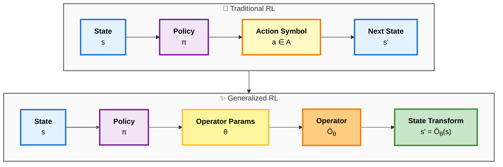
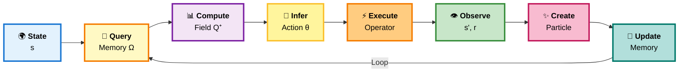

# GRL: Generalized Reinforcement Learning

**Actions as Operators on State Space**

[](https://www.python.org/downloads/)
[](https://pytorch.org/)
[](https://opensource.org/licenses/MIT)

---

## 🎯 What is GRL?

**Generalized Reinforcement Learning (GRL)** redefines the concept of "action" in reinforcement learning. Instead of treating actions as discrete indices or fixed-dimensional vectors, GRL models actions as **parametric operators** that transform the state space.


```mermaid
flowchart TB
    subgraph TRL["🔵 Traditional RL"]
        direction LR
        S1["<b>State</b><br/>s"] --> P1["<b>Policy</b><br/>π"]
        P1 --> A1["<b>Action Symbol</b><br/>a ∈ A"]
        A1 --> NS1["<b>Next State</b><br/>s'"]
    end
    
    TRL --> GRL
    
    subgraph GRL["✨ Generalized RL"]
        direction LR
        S2["<b>State</b><br/>s"] --> P2["<b>Policy</b><br/>π"]
        P2 --> AP["<b>Operator Params</b><br/>θ"]
        AP --> OP["<b>Operator</b><br/>Ô<sub>θ</sub>"]
        OP --> ST["<b>State Transform</b><br/>s' = Ô<sub>θ</sub>(s)"]
    end
    
    style S1 fill:#e3f2fd,stroke:#1976d2,stroke-width:3px,color:#000
    style NS1 fill:#e3f2fd,stroke:#1976d2,stroke-width:3px,color:#000
    style A1 fill:#fff9c4,stroke:#f57c00,stroke-width:3px,color:#000
    style P1 fill:#f3e5f5,stroke:#7b1fa2,stroke-width:3px,color:#000
    
    style S2 fill:#e3f2fd,stroke:#1976d2,stroke-width:3px,color:#000
    style ST fill:#c8e6c9,stroke:#388e3c,stroke-width:3px,color:#000
    style AP fill:#fff59d,stroke:#fbc02d,stroke-width:3px,color:#000
    style OP fill:#ffcc80,stroke:#f57c00,stroke-width:3px,color:#000
    style P2 fill:#f3e5f5,stroke:#7b1fa2,stroke-width:3px,color:#000
    
    style TRL fill:#fafafa,stroke:#666,stroke-width:2px
    style GRL fill:#fafafa,stroke:#666,stroke-width:2px
    
    linkStyle 4 stroke:#666,stroke-width:2px
```

This formulation, inspired by the **least-action principle** in physics, leads to policies that are not only optimal but also physically grounded—preferring smooth, efficient transformations over abrupt changes.

---

## 📖 Tutorial Papers

### Part I: Reinforcement Fields — Particle-Based Learning

**Status:** 🔄 In progress — see the [Research Roadmap](ROADMAP.md) for current chapter status

Particle-based belief representation, energy landscapes, and functional learning over augmented state-action space.

**[Start Learning →](GRL0/tutorials/00-overview.md)** | **[Research Roadmap →](ROADMAP.md)**

| Section | Chapters | Topics |
|---------|----------|--------|
| **Foundations** | [0](GRL0/tutorials/00-overview.md), [1](GRL0/tutorials/01-core-concepts.md), [2](GRL0/tutorials/02-rkhs-foundations.md), [3](GRL0/tutorials/03-energy-and-fitness.md) | Augmented space, particles, RKHS, energy |
| **Field & Memory** | [4](GRL0/tutorials/04-reinforcement-field.md), [4a](GRL0/tutorials/04a-riesz-representer.md), [5](GRL0/tutorials/05-particle-memory.md), [6](GRL0/tutorials/06-memory-update.md), [6a](GRL0/tutorials/06a-advanced-memory-dynamics.md) | Functional fields, Riesz theorem, belief states, MemoryUpdate, advanced memory |
| **Algorithms** | [7](GRL0/tutorials/07-rf-sarsa.md), [7a](GRL0/tutorials/07a-continuous-policy-inference.md), [7b](GRL0/tutorials/07b-rf-q-learning-and-convergence.md), [7c](GRL0/tutorials/07c-experience-replay-and-particle-memory.md) | RF-SARSA, continuous policy inference, RF-Q-learning, experience replay |
| **Interpretation** | 8-10 | Soft transitions, POMDP, synthesis (planned) |

---

### Part II: Reinforcement Fields — Emergent Structure & Spectral Abstraction

**Status:** 📋 Planned (after Part I)

Spectral discovery of hierarchical concepts through functional clustering in RKHS.

| Section | Chapters | Topics |
|---------|----------|--------|
| **Functional Clustering** | 11 | Clustering in function space |
| **Spectral Concepts** | 12 | Concepts as eigenmodes |
| **Hierarchical Control** | 13 | Multi-level abstraction |

**Based on:** Section V of the [original paper](https://arxiv.org/abs/2208.04822)

**Reading time:** ~10 hours total (both parts)

---

### Quantum-Inspired Extensions

**Status:** 🔬 Advanced topics — see the [Research Roadmap](ROADMAP.md)

Mathematical connections to quantum mechanics and novel probability formulations for ML.

**[Explore Advanced Topics →](GRL0/quantum_inspired/README.md)**

| Theme | Chapters | Topics |
|-------|----------|--------|
| **Foundations** | [01](GRL0/quantum_inspired/01-rkhs-quantum-parallel.md), [01a](GRL0/quantum_inspired/01a-wavefunction-interpretation.md), [02](GRL0/quantum_inspired/02-rkhs-basis-and-amplitudes.md) | RKHS-QM parallel, state vs. wavefunction, amplitude interpretation |
| **Complex RKHS** | [03](GRL0/quantum_inspired/03-complex-rkhs.md) | Complex-valued kernels, interference, phase semantics |
| **Projections** | [04](GRL0/quantum_inspired/04-action-and-state-fields.md), [05](GRL0/quantum_inspired/05-concept-projections-and-measurements.md), [06](GRL0/quantum_inspired/06-agent-state-and-belief-evolution.md) | Action/state fields, concept subspaces, belief dynamics |
| **Learning & Memory** | [07](GRL0/quantum_inspired/07-learning-the-field-beyond-gp.md), [08](GRL0/quantum_inspired/08-memory-dynamics-formation-consolidation-retrieval.md) | Beyond GP, memory dynamics, principled consolidation |
| **Paths & Kernels** | [09](GRL0/quantum_inspired/09-path-integrals-and-action-principles.md), [10](GRL0/quantum_inspired/10-complex-kernels-tutorial.md) | Path integrals and action principles, complex-kernel patterns |

**Novel Contributions:**

- **Amplitude-based RL:** Complex-valued value functions with phase semantics
- **MDL consolidation:** Information-theoretic memory management
- **Concept-based MoE:** Hierarchical RL via subspace projections

---

## 🔑 Key Innovations

| Aspect | Classical RL | GRL |
|--------|--------------|-----|
| **Action** | Discrete index or vector | Parametric operator $\hat{O}(\theta)$ |
| **Action Space** | Finite or bounded | Continuous manifold |
| **Value Function** | $Q(s, a)$ | Reinforcement field $Q^+(s, \theta)$ over augmented space |
| **Experience** | Replay buffer | Particle memory in RKHS |
| **Policy** | Learned function | Inferred from energy landscape |
| **Uncertainty** | External (dropout, ensembles) | Emergent from particle sparsity |

### GRL as a Unifying Framework

**Key Insight**: Traditional RL algorithms (Q-learning, DQN, PPO, SAC, **RLHF for LLMs**) are **special cases** of GRL!

When you:

- **Discretize actions** → GRL recovers Q-learning
- **Use neural networks** → GRL recovers DQN
- **Apply Boltzmann policies** → GRL recovers REINFORCE/Actor-Critic
- **Fine-tune LLMs** → GRL generalizes RLHF

**[See: Recovering Classical RL from GRL →](GRL0/recovering_classical_rl.md)**

### Why GRL?

- **Generalization**: Subsumes existing methods as special cases
- **Continuous actions**: No discretization, full precision
- **Smooth interpolation**: Nearby parameters → similar behavior  
- **Compositional**: Operators can be composed (operator algebra)
- **Uncertainty**: Sparse particles = high uncertainty (no ensembles needed)
- **Interpretability**: Energy landscapes, particle inspection
- **Modern applications**: Applies to RLHF, prompt optimization, neural architecture search

---

## 🚀 Quick Start

### Installation

```bash
# Clone the repository
git clone https://github.com/pleiadian53/GRL.git
cd GRL

# Create environment with mamba/conda
mamba env create -f environment.yml
mamba activate grl

# Install in development mode
pip install -e .

# Verify installation (auto-detects CPU/GPU/MPS)
python scripts/verify_installation.py
```

See **[INSTALL.md](https://github.com/pleiadian53/GRL/blob/main/INSTALL.md)** for detailed setup, troubleshooting, and GPU notes.

### First Steps

1. **Read the tutorial**: Start with [Chapter 0: Overview](GRL0/tutorials/00-overview.md)
2. **Explore concepts**: Work through [Chapter 1: Core Concepts](GRL0/tutorials/01-core-concepts.md)
3. **Understand algorithms**: Work through [Chapter 7: RF-SARSA](GRL0/tutorials/07-rf-sarsa.md) and its supplements on [continuous policy inference](GRL0/tutorials/07a-continuous-policy-inference.md) and [RF-Q-learning](GRL0/tutorials/07b-rf-q-learning-and-convergence.md)
4. **Implement**: Follow the [implementation guide](GRL0/implementation/README.md)

---

## 📁 Project Structure

```
GRL/
├── src/grl/                    # Core library
│   ├── core/                   # Particle memory, kernels
│   ├── algorithms/             # MemoryUpdate, RF-SARSA
│   ├── envs/                   # Environments
│   └── visualization/          # Plotting tools
├── docs/                       # 📚 Public documentation
│   └── GRL0/                   # Tutorial paper (Reinforcement Fields)
│       ├── tutorials/          # Tutorial chapters
│       ├── paper/              # Paper-ready sections
│       └── implementation/     # Implementation specs
├── notebooks/                  # Jupyter notebooks
│   └── vector_field.ipynb     # Vector field demonstrations
├── examples/                   # Runnable examples
├── scripts/                    # Utility scripts
├── tests/                      # Unit tests
└── configs/                    # Configuration files
```

---

## 📄 Documentation

### Tutorial Papers: Reinforcement Fields (Two Parts)

**Part I: Particle-Based Learning**

- **[Start Here](GRL0/tutorials/00-overview.md)** — Overview
- **[Tutorials](GRL0/tutorials/README.md)** — Chapter-by-chapter learning
- **[Implementation](GRL0/implementation/README.md)** — Technical specifications

**Part II: Emergent Structure & Spectral Abstraction** (Planned)

### Additional Resources

- **[Installation Guide](https://github.com/pleiadian53/GRL/blob/main/INSTALL.md)** — Detailed setup instructions
- **[Implementation Guide](GRL0/implementation/README.md)** — Technical specifications
- **[Research Roadmap](ROADMAP.md)** — Future directions. **The single source of truth for status**
- **[Interactive Notebooks](notebooks/README.md)** — Jupyter demos with visualizations

---

## 🔬 Research Papers

### Original Paper (arXiv 2022)

**[Generalized Reinforcement Learning: Experience Particles, Action Operator, Reinforcement Field, Memory Association, and Decision Concepts](https://arxiv.org/abs/2208.04822)**

*Po-Hsiang Chiu, Manfred Huber*  
arXiv:2208.04822 (2022) — 37 pages, 15 figures

The foundational work introducing particle-based belief states, reinforcement fields, and concept-driven learning.

---

### Tutorial Papers (This Repository)

**Reinforcement Fields Framework** — Enhanced exposition with modern formalization

**Part I: Particle-Based Learning**

- Functional fields over augmented state-action space
- Particle memory as belief state in RKHS
- MemoryUpdate and RF-SARSA algorithms
- Emergent soft state transitions, POMDP interpretation

**Status:** 🔄 Tutorial in progress — see the [Research Roadmap](ROADMAP.md)

**Part II: Emergent Structure & Spectral Abstraction**

- Functional clustering (clustering functions, not points)
- Spectral methods on kernel matrices
- Concepts as coherent subspaces of the reinforcement field
- Hierarchical policy organization

**Status:** 📋 Planned (after Part I)

---

### Planned Extensions

| Paper | Title | Status | Progress |
|-------|-------|--------|----------|
| **Paper A** | **Generalized Reinforcement Learning — Actions as Operators** | 🟢 Draft Complete | **~70%** |
| | *Operator algebra, generalized Bellman equation, energy regularization* | | Complete draft, 3/7 figures, proofs outlined |
| **Paper B** | **Operator Policies — Learning State-Space Operators with Neural Operator Networks** *(tentative)* | ⏳ Planned | **~0%** |
| | *Neural operators, scalable training, operator-actor-critic* | | After Paper A |
| **Paper C** | **Applications of GRL to Physics, Robotics, and Differentiable Control** *(tentative)* | ⏳ Planned | **~0%** |
| | *Physics-based control, compositional behaviors, transfer learning* | | After Paper B |

**Timeline:**

- **Paper A:** Target submission April 2026 (NeurIPS/ICML)
- **Paper B:** Target submission June 2026 (ICML/NeurIPS)
- **Paper C:** Target submission July 2026 (CoRL)

**See:** [Research Roadmap](ROADMAP.md) for detailed timeline and additional research directions.

---

## 📊 How GRL Works: Particle-Based Learning


```mermaid
flowchart LR
    A["🌍 <b>State</b><br/>s"] --> B["💾 <b>Query</b><br/>Memory Ω"]
    B --> C["📊 <b>Compute</b><br/>Field Q⁺"]
    C --> D["🎯 <b>Infer</b><br/>Action θ"]
    D --> E["⚡ <b>Execute</b><br/>Operator"]
    E --> F["👁️ <b>Observe</b><br/>s', r"]
    F --> G["✨ <b>Create</b><br/>Particle"]
    G --> H["🔄 <b>Update</b><br/>Memory"]
    H -->|Loop| B
    
    style A fill:#e3f2fd,stroke:#1976d2,stroke-width:3px,color:#000
    style B fill:#fff9c4,stroke:#f57c00,stroke-width:3px,color:#000
    style C fill:#f3e5f5,stroke:#7b1fa2,stroke-width:3px,color:#000
    style D fill:#fff59d,stroke:#fbc02d,stroke-width:3px,color:#000
    style E fill:#ffcc80,stroke:#f57c00,stroke-width:3px,color:#000
    style F fill:#c8e6c9,stroke:#388e3c,stroke-width:3px,color:#000
    style G fill:#f8bbd0,stroke:#c2185b,stroke-width:3px,color:#000
    style H fill:#b2dfdb,stroke:#00796b,stroke-width:3px,color:#000
```

### Code Example

```python
from grl.core import ParticleMemory
from grl.core import RBFKernel
from grl.algorithms import MemoryUpdate, RFSarsa

# Create particle memory (the agent's belief state)
memory = ParticleMemory()

# Define similarity kernel
kernel = RBFKernel(lengthscale=1.0)

# Learning loop
for episode in range(num_episodes):
    state = env.reset()
    
    for step in range(max_steps):
        # Infer action from particle memory
        action = infer_action(memory, state, kernel)
        
        # Execute and observe
        next_state, reward, done = env.step(action)
        
        # Update particle memory (belief transition)
        memory = memory_update(memory, state, action, reward, kernel)
        
        state = next_state
```

---

## 📝 Citation

### Original arXiv Paper

The foundational work is available on arXiv:

**Chiu, P.-H., & Huber, M. (2022).** *Generalized Reinforcement Learning: Experience Particles, Action Operator, Reinforcement Field, Memory Association, and Decision Concepts.* arXiv:2208.04822.

```bibtex
@article{chiu2022generalized,
  title={Generalized Reinforcement Learning: Experience Particles, Action Operator, 
         Reinforcement Field, Memory Association, and Decision Concepts},
  author={Chiu, Po-Hsiang and Huber, Manfred},
  journal={arXiv preprint arXiv:2208.04822},
  year={2022},
  url={https://arxiv.org/abs/2208.04822}
}
```

**[Read on arXiv →](https://arxiv.org/abs/2208.04822)**

---

### Tutorial Papers (This Repository)

The tutorial series provides enhanced exposition and modern formalization:

**Part I: Particle-Based Learning** (In progress)
```bibtex
@article{chiu2026part1,
  title={Reinforcement Fields: Particle-Based Learning},
  author={Chiu, Po-Hsiang and Huber, Manfred},
  journal={In preparation},
  year={2026}
}
```

**Part II: Emergent Structure & Spectral Abstraction** (Planned)
```bibtex
@article{chiu2026part2,
  title={Reinforcement Fields: Emergent Structure and Spectral Abstraction},
  author={Chiu, Po-Hsiang and Huber, Manfred},
  journal={In preparation},
  year={2026}
}
```

---

### Operator Extensions (Future Work)

```bibtex
@article{chiu2026operators,
  title={Generalized Reinforcement Learning — Actions as Operators},
  author={Chiu, Po-Hsiang},
  journal={In preparation},
  year={2026+}
}
```

---

## 📜 License

This project is licensed under the MIT License - see the [LICENSE](LICENSE) file for details.

---

## 🌟 The GRL Framework

**GRL** (Generalized Reinforcement Learning) is a family of methods that rethink how actions are represented and learned.

**Original paper:** [arXiv:2208.04822](https://arxiv.org/abs/2208.04822) (Chiu & Huber, 2022)

### Reinforcement Fields (This Repository)

**Two-Part Tutorial Series:**

**Part I: Particle-Based Learning**

- Actions as continuous parameters in augmented state-action space
- Particle memory as belief state, kernel-induced value functions
- Learning through energy landscape navigation

**Part II: Emergent Structure & Spectral Abstraction**

- Concepts emerge from functional clustering in RKHS
- Spectral methods discover hierarchical structure
- Multi-level policy organization

**Key Innovation**: Learning emerges from particle dynamics in function space, not explicit policy optimization.

---

### Actions as Operators (Paper A — In Development)

**Core Idea**: Actions as parametric operators that transform state space, with operator algebra providing compositional structure.

**Key Innovation**: Operator manifolds replace fixed action spaces, enabling compositional behaviors and physical interpretability.

**Four-Part Series:** [Part 1](action_operator/01-the-grl0-gap.md) (the GRL0 gap) · [Part 2](action_operator/02-action-operator-formalization.md) (formalization) · [Part 3](action_operator/03-from-fixed-to-learned-kernels.md) (learned kernels) · [Part 4](action_operator/04-the-minimum-viable-experiment.md) (the experiment)

Parts 1-3 are theory. [Part 4](action_operator/04-the-minimum-viable-experiment.md) reports the first experiment, running in the sibling **[ssl-lab](https://github.com/pleiadian53/ssl-lab)** project on the Norman 2019 cell-perturbation dataset, a domain where an action genuinely is an operator and where held-out gene combinations test operator *composition* against measured biology. The headline result is **negative and reported as one**: the operator ties the flow it was meant to improve on, and a ceiling analysis shows the stage it occupies had only 0.031 of headroom to move the metric.

---

## 🙏 Acknowledgments

### Mathematical Foundations

**Core Framework:**

- Formulated in **Reproducing Kernel Hilbert Spaces (RKHS)** — the functional framework for particle-based belief states
- **Kernel methods** define the geometry and similarity structure of augmented state-action space
- Inspired by the **least-action principle** in classical mechanics

**Quantum-Inspired Probability:**

- **Probability amplitudes** instead of direct probabilities — RKHS inner products as amplitude overlaps
- **Complex-valued RKHS** enabling interference effects and phase semantics for temporal/contextual dynamics
- **Wave function analogy** — The reinforcement field as a superposition of particle basis states
- This formulation is **novel to mainstream ML** and opens new directions for probabilistic reasoning

See: [Quantum-Inspired Extensions](GRL0/quantum_inspired/README.md) for technical details.

### Conceptual Connections
- **Energy-based models** (EBMs) — Control as energy landscape navigation
- **POMDPs** and **belief-based control** — Particle ensembles as implicit belief states
- **Score-based methods** — Energy gradients guide policy inference

### Implementation Tools
- **Gaussian process regression** can model scalar energy fields (but is not essential to the framework)
- **Neural operators** for learning parametric action transformations
- **Diffusion models** share the gradient-field perspective

---

**[📚 Start the Tutorial →](GRL0/tutorials/00-overview.md)**
