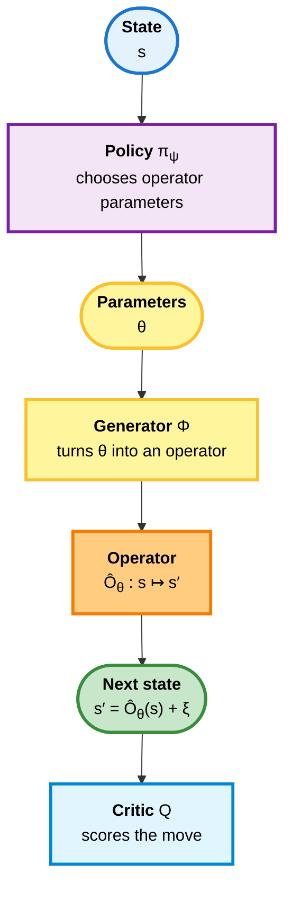

# Learning with Action Operators — Overview

**Series:** Learning with Action Operators
**Part:** 0 of 3 (overview)
**Audience:** Readers comfortable with basic RL (states, actions, rewards) who want to understand *how an operator-valued policy is actually trained*.

This series expands one idea that the action-operator formalization introduces only in passing: the **differentiable end-to-end pipeline** by which an agent learns to choose operators. It is a "how the learning actually works" companion to the [Action Operators](../action_operator/01-the-grl0-gap.md) series — covering the actor–critic architecture, the deep-RL components it relies on, and exactly how a learning signal flows back into the policy.

We assume nothing about deep-RL conventions: every symbol is defined where it first appears, and each idea is illustrated on a small running example.

---

## 1. The pipeline

In classical reinforcement learning the agent emits a symbol $a$ (an action) and the *environment* decides the next state. In the operator view, the agent instead emits the *parameters of a state-transformation* and applies it. The forward pipeline is:

In symbols (read the arrows left to right):

$$
s \xrightarrow{\pi_\psi} \theta \xrightarrow{\Phi} \hat{O}_\theta \xrightarrow{\text{apply}} s' = \hat{O}_\theta(s) + \xi.
$$

| Symbol | Reads as | Meaning |
|---|---|---|
| $s,\ s'$ | "state", "next state" | The state now and after one step. |
| $\pi_\psi$ | "pi-sub-psi" | The **policy** — a neural network with weights $\psi$ that reads $s$ and outputs operator parameters. |
| $\psi$ | "psi" | The policy's trainable weights. |
| $\theta$ | "theta" | The **operator parameters** the policy emits. |
| $\Phi$ | "Phi" | The **generator** — a differentiable function that turns $(\theta, s)$ into a next state. |
| $\hat{O}_\theta$ | "O-hat-theta" | The **operator** built from $\theta$: $\hat{O}_\theta(s) = \Phi(\theta, s)$, a map from states to states. |
| $\xi$ | "xi" | Additive **noise** (exploration during learning, or unmodeled effects). |

The policy chooses *how to transform the state*; the generator makes that choice concrete; applying it (plus noise) gives the next state.

---

## 2. What "learning" means here

Two things are learned, by two cooperating networks — the **actor–critic** pattern:

- The **critic** learns to *judge*: given a state and the move the agent made, how much total future reward can it expect? This is a value estimate.
- The **actor** (the policy $\pi_\psi$) learns to *act*: it is adjusted so the operators it picks lead to states the critic rates highly, while keeping the operators "gentle" (a least-action preference).

Learning alternates: the critic is fit to the rewards actually observed, and the actor is nudged to exploit what the critic has learned. Repeating this drives the policy toward good operators. Part 1 defines the critic, the actor, and every supporting component precisely.

---

## 3. How a learning signal flows back (the key idea)

Here is the move that makes operator learning clean. In classical RL the transition $s' = T(s, a)$ is the environment's black box — you cannot differentiate a downstream reward with respect to the action *through* the environment. In the operator view, the next state is produced by the agent's **own** differentiable function $\Phi$:

$$
s' = \hat{O}_\theta(s) + \xi = \Phi(\theta, s) + \xi.
$$

So the sensitivity of the next state to the parameters, $\partial s' / \partial \theta$, is available — it is ordinary backpropagation through $\Phi$. That turns the whole forward pipeline into a differentiable chain: a value signal at $s'$ can be pulled **backward** through the operator, through the generator, and into the policy weights $\psi$. Forward computes a value; backward carries that value's gradient to the policy:

$$
\text{forward: } s \to \theta \to s' \to \text{value} \qquad\qquad \text{backward: } \text{value} \to s' \to \theta \to \psi.
$$

Part 2 makes this chain rule explicit, with a worked example, and is careful about one assumption it relies on: this gradient is a faithful learning signal to the extent that $\Phi$ actually models the one-step dynamics. (When the operator family *is* the environment's dynamics, that holds by construction; otherwise it is a modeling choice worth stating.)

---

## 4. The series

| Part | Title | What it covers |
|---|---|---|
| 0 | Overview (this doc) | The pipeline, what is learned, and the gradient idea at a glance. |
| 1 | [Actor–critic and its components](01-actor-critic-and-components.md) | Critic, actor, value functions, the Bellman target, replay buffer, twin critics, and stable targets — every term defined, with a navigation example. |
| 2 | [How gradients flow](02-how-gradients-flow.md) | The differentiable pipeline made explicit: the chain rule, the two ways to get a gradient, a worked example, and the assumptions involved. |

A further part on **stable targets and memory** (how a slowly-updated "target" stabilizes learning, and how it connects to particle-memory consolidation) is planned.

---

**Next:** [Part 1: Actor–critic and its components](01-actor-critic-and-components.md)
